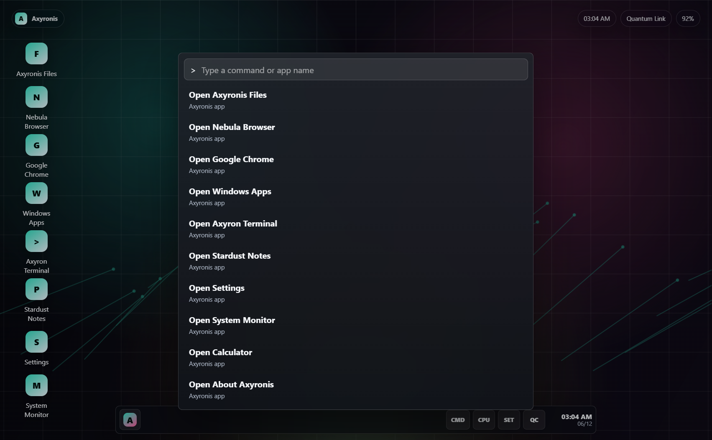
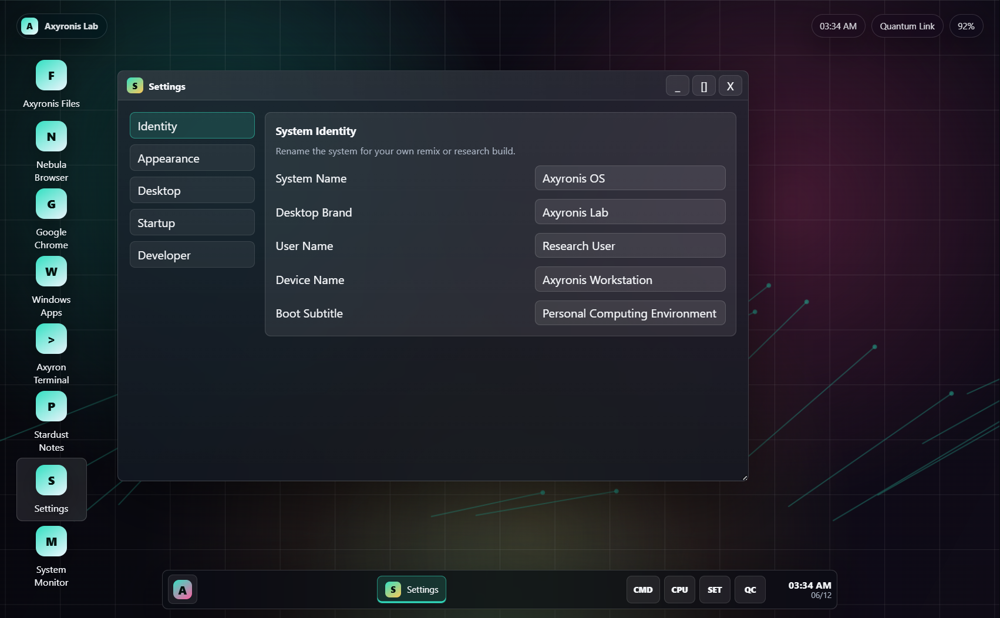

# Axyronis OS

Axyronis OS is an educational virtual desktop environment built with HTML, CSS, JavaScript, and Electron. It is not a real operating system kernel. It is a Windows-hosted desktop shell experiment designed for learning, UI prototyping, and creative remixing.





## Project Statement

This project is shared for learning, research, and secondary creation. You may study how it works, modify the interface, add apps, redesign the desktop, or use it as a starting point for your own virtual computer environment.

Axyronis can launch real Windows programs when running in Electron mode, so treat the terminal and app launcher with the same care you would use in Windows itself.

## Ongoing Updates

I will keep updating and improving this system over time. The goal is to make Axyronis more useful for learners, remixers, UI designers, and people studying how a virtual desktop environment can be built.

Released versions are published with Git tags so users can download different versions. The current version is `v1.0.0`, the Wallpaper Studio release. Future feature releases will continue as `v1.1.0`, `v1.2.0`, and so on.

## Remix Freedom

You are welcome to make major changes. You may rename the system, replace the Axyronis brand, reorganize files, rewrite the UI, add or remove apps, change the architecture, build a new shell on top of it, or use pieces of the code for research and learning.

The Settings app includes an Identity section so users can rename the system, desktop brand, user name, device name, and boot subtitle without editing source code. This is meant to encourage experimentation and secondary creation.

## What It Can Do

- Desktop shell with icons, taskbar, start menu, window manager, context menu, and glass-style UI.
- Electron desktop mode with controlled native access through a preload bridge.
- Real Windows app launcher for Chrome, Edge, File Explorer, Notepad, Calculator, Task Manager, Command Prompt, PowerShell, and Paint.
- Nebula Browser with a real Electron `webview`.
- Local file browser in desktop mode.
- Axyron Terminal with built-in commands and native command execution.
- Command Palette, available from the `CMD` taskbar button or `Ctrl + K`.
- Quick Center, available from the `QC` taskbar button or `Ctrl + Q`.
- One-click Power Workspace layout from the Command Palette.
- Advanced Settings app with Identity, Appearance, Desktop, Startup, and Developer sections.
- User-editable system name, desktop brand, user name, device name, and boot subtitle.
- Wallpaper Studio with built-in presets and local image selection in Electron mode.

## Settings Are The Core

The Settings app is designed as the most important part of the system. It lets learners change identity, appearance, desktop behavior, startup behavior, and developer/remix options without touching the source first.

Current settings include:

- System Name
- Desktop Brand
- User Name
- Device Name
- Boot Subtitle
- Accent Color
- Light Mode
- Wallpaper Dim
- Glass Blur
- Startup Mode
- Developer freedom notes

## Version Downloads

Users can download different versions from GitHub tags or releases.

- `v1.0.0`: Wallpaper Studio release.
- `v1.1.0`: Reserved for the next feature update.
- `v1.2.0`: Reserved for later feature updates.

Use `main` for the newest development version.

## Run It

### Recommended Desktop Mode

Double-click:

```bat
Start-Axyronis.bat
```

If dependencies are missing, run:

```bat
Install-Axyronis-Desktop.bat
```

### Manual Development Mode

```bash
cd AxyronisOS
npm install
npm start
```

### Browser Preview Mode

Open:

```text
AxyronisOS/index.html
```

Browser preview mode cannot launch local Windows apps. Use Electron mode for native features.

## Project Structure

```text
AxyronisOS/
  index.html          Main desktop shell markup
  styles.css          Visual system, layout, windows, panels, controls
  app.js              Desktop apps, window manager, command palette, UI logic
  electron-main.js    Electron main process and native Windows integration
  preload.js          Safe bridge between UI code and native APIs
  assets/             Wallpaper and visual assets
```

## How To Modify It

- Add a new built-in app in `AxyronisOS/app.js` by adding an entry to the `apps` array and writing a `renderYourApp()` function.
- Add a real Windows launcher in `AxyronisOS/electron-main.js` by extending the `windowsApps` object.
- Change the desktop theme in `AxyronisOS/styles.css`, especially the `:root` variables.
- Change default names and settings in `defaultPreferences` inside `AxyronisOS/app.js`.
- Add Command Palette actions in `getCommands()` inside `AxyronisOS/app.js`.
- Add Quick Center controls in `index.html` and style them in `styles.css`.
- Add wallpaper presets in `wallpaperPresets` inside `AxyronisOS/app.js`.

## Safety Notes

- Axyronis is a desktop shell experiment, not a replacement for Windows.
- Native mode can run real commands and open real programs.
- Do not run destructive commands unless you understand them.
- Keep `nodeIntegration` disabled and use `preload.js` for native APIs.

## License

This project is released under the MIT License. See [LICENSE](LICENSE).
